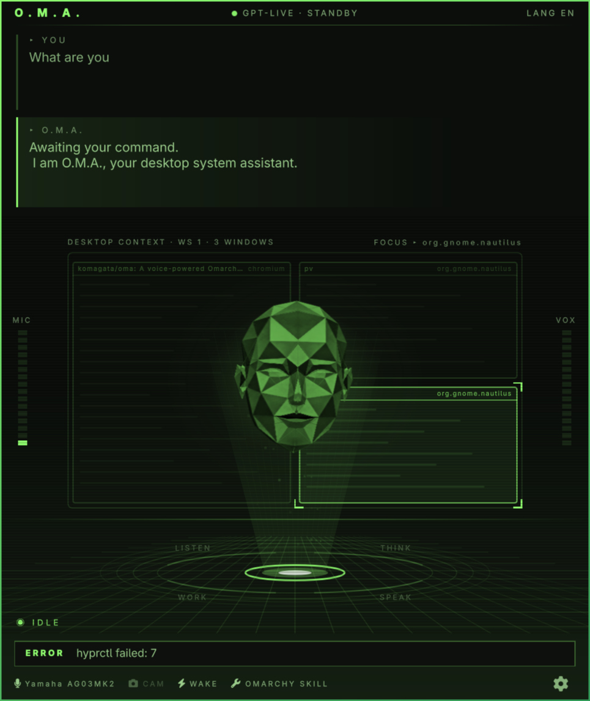
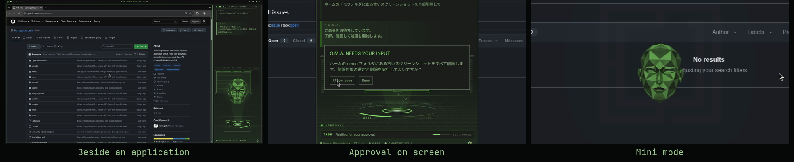

# O.M.A.

**Omarchy Machine Assistant**, pronounced **OH-mah（オーマ）**.

A voice assistant for the Omarchy desktop with a theme-colored low-poly face.
Talk with GPT-Live, ask it to operate your PC, and remember useful preferences
between conversations.





- Spoken conversation with captions, microphone selection, and language settings.
- A holographic interface in your theme color. Every part reports real state: the
  desktop map shows the windows O.M.A. knows about and marks the task target, the
  ring lights LISTEN, THINK, SPEAK, or WORK, the MIC and VOX meters show your voice
  and O.M.A.'s, and the task bar shows running work.
- Desktop tools guided by the bundled O.M.A. skills and your installed Omarchy skill.
- Locally stored memories and searchable conversation transcripts.
- A compact mini mode and a companion tile beside an application.
- Optional voice wake and camera support.

## Requirements

- **Omarchy Quattro**, with its desktop shell and Omarchy skill installed.
- **An OpenAI project API key with GPT-Live access** and API billing enabled.
  ChatGPT subscriptions do not include API usage. Voice sessions incur duration
  charges, with additional usage for the Responses backend.
- A working microphone and audio output. Setup checks for **Node.js 24+**, npm,
  **Python 3 with NumPy**, PipeWire with WebRTC echo cancellation, WirePlumber,
  grim, wtype, xdg-open, setpriv, secret-tool for desktop keyring support,
  xdg-terminal-exec, and systemd-run, and offers to
  install missing dependencies.

Mouse control requires the optional C/Wayland helper built during setup.
Camera support requires FFmpeg and v4l2-ctl. Optional voice wake uses local Vosk
recognition and downloads Japanese and English models during setup.

## Install and set up

```sh
omarchy plugin add https://github.com/komagata/oma --enable
```

1. Open O.M.A. from its bar icon, then open **Settings**. On the welcome screen,
   select **Get started**. If dependencies are missing, select
   **Set up this computer** on the next screen.
   If the setup terminal cannot open, run
   `bash ~/.config/omarchy/plugins/io.github.komagata.oma/scripts/setup`
   in your terminal, then reopen Settings.
2. Enter your **OpenAI API key** and select **Save key**. One key connects both
   GPT-Live and the Responses backend. Saved keys stay masked; enter a replacement
   and select **Update key** to save it to the desktop keyring.
3. Choose **Microphone** and **Spoken language**. The microphone choice applies
   to conversation and voice wake without changing your system default.
   Use **Refresh devices** after connecting a device.
4. Select **Test voice** for a short, billable playback test that does not record
   your microphone, then **Start talking**.

Setup offers an optional **F8** shortcut when the key is available. Voice wake
also needs to be enabled in Preferences after setup. Setup does not update the
whole system or restart the desktop shell.

## Use

Open O.M.A. with the bar icon, F8 if configured, or by saying “Hey OH-mah” in
English or “ヘイ、オーマ” in Japanese if voice wake is enabled. Speak naturally; GPT-Live handles continuous listening and speech.
Try “Open the last URL”, “Create a new note in OmaText”, “Remember that I use
Chromium”, or, with camera support configured, “What am I holding?”

Consequential actions require the local confirmation buttons; a spoken “yes” is
not approval. Talking over a reply does not cancel PC work. Use **Stop** or
**Escape** to close the session and cancel pending local operations; this does
not undo completed actions. Say “Thanks, bye” to end a conversation; O.M.A.
answers with a short recorded farewell and its closing sound.

Paid sessions connect when you open a conversation and close when it ends.
After inactivity, O.M.A. gives a reminder and then says goodbye and dismisses
itself. Pending tasks, approvals, and accompanying an application pause idle
dismissal. Opening Settings and the local wake listener do not open paid sessions.

### Transcripts

Setup installs the `oma` command in `~/.local/bin`; keep that directory on `PATH`.
After updating an existing installation, rerun `scripts/install-cli` from the
plugin directory so `~/.local/bin/oma` uses the current payload layout.

```sh
oma transcript          # Open the current or most recent conversation
oma transcript --today  # Open today's conversations (local timezone)
oma transcript --follow # Follow live captions in the terminal; Ctrl+C exits
```

Plain-text exports open in your default text application via `xdg-open`; a
terminal editor such as Omarchy's default Neovim opens in a terminal through
`omarchy-launch-editor`. Exports are stored under `~/.local/share/oma/transcripts/` by default. Run the command again
to refresh an export, or use `--follow`. Captions are model transcripts, not an
exact record of what you heard, especially when speech is interrupted.

### Mini mode

Say “Switch to mini mode” to show only the animated face in a small window.
Say “Return to normal mode” or double-click the face to toggle modes.
Audio and conversation continue; approvals, questions, and errors temporarily
show the full interface. The mode lasts until the plugin reloads.

### Window

O.M.A. is an ordinary window. At startup it registers its own Hyprland window
rules (floating, centered, opaque, and a borderless mini mode), and registers
them again after a Hyprland config reload, so your Hyprland configuration needs
no edits.

### Alongside an application

While O.M.A. is visible, opening a regular application on its workspace and
monitor automatically places O.M.A. in a narrow tile on its right, including
manual launches and launches while Settings is open. This layout handling does
not start an AI session. Existing windows, focus changes, other workspaces or
monitors, and detectable dialogs/popups do not trigger it.
Closing that application restores O.M.A.'s previous floating position, size,
and mode; changing focus does not. Say “Come back” to restore the floating
window without closing the application. This requires Hyprland's **dwindle**
layout and a regular, non-fullscreen application window.

## Data and configuration

O.M.A. uses cloud AI: conversation audio goes to OpenAI, and the Responses
backend receives the context needed for tasks, including saved facts and desktop
window metadata. Local storage does not make conversations offline or keep all
content on this PC.

Memories and transcripts are stored locally in `~/.local/share/oma` by default.
Ask O.M.A. to remember preferences, search past captions and URLs, or forget
matching records. Forgetting also deletes matching transcript rows and generated
exports, and closes the current voice session. It does not erase copies or
backups saved elsewhere.

The defaults are `gpt-live-1` with voice `cedar` and a `gpt-6-luna` Responses
backend with low reasoning effort. Advanced worker environment overrides are
`OMA_LIVE_VOICE` and `OMA_BACKEND_MODEL`.

## Update

For a Git-managed installation created with `omarchy plugin add`:

```sh
omarchy plugin update io.github.komagata.oma
```

## Development

Production QML lives in [`qml/`](qml): `BarWidget.qml`, `Overlay.qml` and
`Service.qml` are the host entry points; [`qml/views/`](qml/views) contains
Conversation and Settings; [`qml/components/`](qml/components) contains shared
visual components. The root `manifest.json` points into this tree. Directory
imports and relative resource paths work in both Git checkouts and immutable
`builds/<hash>/` packages; runtime, scripts and assets remain beside `qml/`.

From a development checkout:

```sh
npm ci --omit=dev --ignore-scripts --bin-links=false
bash tests/run
omarchy plugin validate .
```

The offline suite includes QML/GPU fixtures when Qt is available. The `tests/live*`
checks are opt-in and billable, and some use the real microphone or desktop;
inspect each file before running it. See [verification](docs/VERIFICATION.md)
for coverage and limitations.

To install a development checkout locally, run `scripts/install-local`. It
builds the mouse helper, installs the [runtime payload](scripts/runtime-files.txt)
with its own production dependencies, and reloads only O.M.A. Older builds are
retained. **This installer refuses Git-managed installations**; use the update
command above for those. Installing npm dependencies alone does not install the
Omarchy plugin.

See [design](docs/DESIGN.md), [architecture decisions](docs/adr/README.md),
[package footprint](docs/FOOTPRINT.md), and the [historical archive](docs/ARCHIVE.md)
for details.

## Remove

```sh
omarchy plugin remove io.github.komagata.oma
```

Local memories and transcripts remain in `~/.local/share/oma`.
